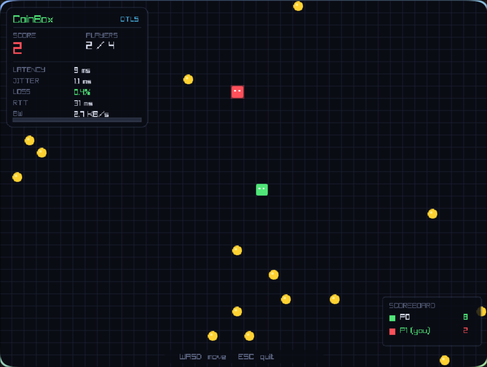
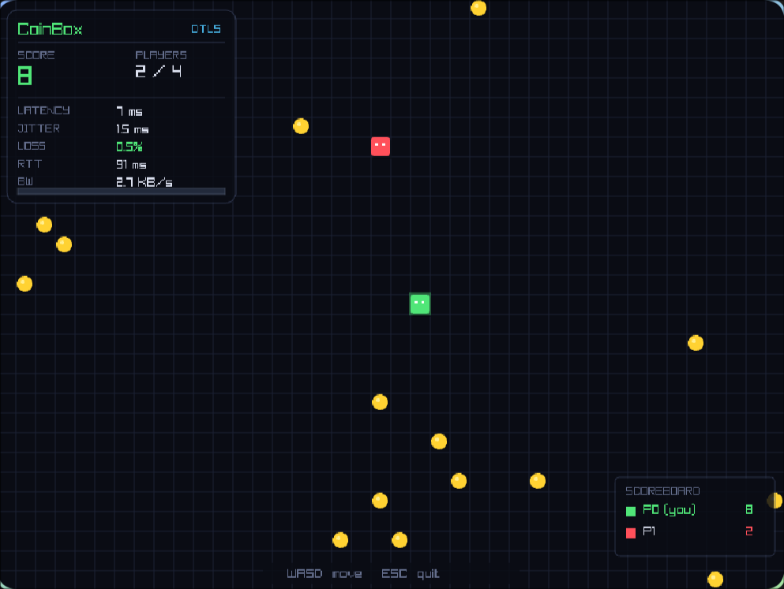
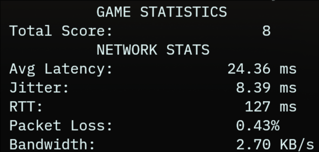

# Real Time Multiplayer Game Networing Engine

**Up to 4 players connect to a central server and move blocks around a grid collecting coins**
- All communication uses raw UDP sockets (`SOCK_DGRAM`) with no networking framework
- Every connection is encrypted end-to-end using DTLS 1.2 (OpenSSL)
- The server runs at 30 Hz simulation and 15 Hz broadcast : deliberately decoupled
- Clients predict movement locally so the game feels instant even with high latency
- 20% packet loss is simulated deliberately to test and demonstrate loss tolerance
- Five network metrics are tracked live and displayed on the HUD: latency, jitter, RTT, packet loss, bandwidth


## Setup

### 1. Clone the repo

```bash
git clone https://github.com/Dharani9018/Socket_Programming.git
cd Socket_Programming
```

### 2. Install dependencies
```bash
sudo pacman -S gcc raylib openssl
```

### 3. Generate TLS certificate and key

The server needs a self-signed certificate for DTLS. Run this once:
```bash
make certs
```
This generates `cert.pem` and `key.pem` in the project root.
### 4. Build

```bash
make clean && make
```

This produces two binaries: `game_server` and `game_client`.

---

## Running

### Start the server

```bash
./game_server
```

Expected output:
```
    CoinBox SERVER    
Transport : DTLS 1.2 over UDP (OpenSSL)
Port      : 8080
Sim rate  : 30 Hz
Net rate  : 15 Hz
Loss sim  : 20% on plain UDP (JOIN only)
Waiting for players...
```

### Start a client

```bash
./game_client 127.0.0.1
```
Expected Output: 


On exit:


Replace `127.0.0.1` with the server's IP address to connect from another machine on the same network.

### Multiple clients

Open a new terminal for each client:

```bash
# Terminal 2
./game_client 127.0.0.1

# Terminal 3
./game_client 127.0.0.1

# Terminal 4
./game_client 127.0.0.1
```

Up to 4 clients can connect simultaneously.

---

## Controls

| Key | Action |
|-----|--------|
| W | Move up |
| A | Move left |
| S | Move down |
| D | Move right |
| ESC | Quit |
---

## Network Metrics (shown live on HUD)

| Metric | How It Is Measured |
|--------|-------------------|
| Latency | Server embeds send timestamp in every snapshot. Client subtracts it from receive time. EWMA smoothed. |
| Jitter | EWMA of the absolute difference between consecutive latency samples. |
| RTT | Client sends MSG_PING every second. Server replies MSG_PONG immediately. Client measures elapsed time. |
| Packet Loss | Server puts a sequence number on every snapshot. Client counts gaps in the sequence. |
| Bandwidth | Client counts bytes received per second in a 1-second sliding window. |

---

## How the Networking Works

### How DTLS works here

DTLS is TLS (the encryption used by HTTPS) adapted for UDP. The connection sequence is:

```
1. Client sends MSG_JOIN over plain UDP
2. Server assigns a player slot and opens a dedicated socket for that client
3. Server sends player ID back over plain UDP
4. DTLS handshake runs on the dedicated socket (encrypted from this point)
5. All game traffic (inputs, snapshots, ping/pong) goes through SSL_write / SSL_read
```

The server opens one dedicated connected UDP socket per client. This is required because DTLS needs a `connect()`-ed socket to correctly address outgoing records to one specific peer.

### How client prediction works

Without prediction, every key press would feel delayed by the network round trip time. With prediction:

```
1. Key pressed → client moves the cat immediately (no waiting)
2. Input is stored in a buffer and sent to the server
3. Server processes the input and sends back the authoritative position
4. Client applies the server position, then replays any inputs
   the server has not confirmed yet — this keeps the local
   position consistent with what the server will eventually confirm
```

### How packet loss is handled

20% of packets are dropped randomly (simulated in `send_packet()` in `network.c`). The game handles this in two ways:

- **Reconciliation** — if a snapshot is lost, the client keeps its unacknowledged inputs in the buffer and replays them when the next snapshot arrives
- **Sequence counting** — gaps in snapshot sequence numbers tell the client exactly how many packets were lost, which is reported as the loss percentage on the HUD

### Update rates

```
Server simulation : 30 Hz (one input processed per player every 33ms)
Server broadcast  : 15 Hz (snapshot sent to all clients every 66ms)
Client render     : 60 Hz (frame drawn every 16ms using predicted position)
Client input send : 30 Hz (rate-limited to match server tick, prevents queue buildup)
```

Simulation runs faster than broadcast so game logic stays stable even if a broadcast is missed. Rendering runs faster than both so movement looks smooth between snapshots.

---

## Packet Loss Simulation

The 20% loss is intentional : it forces the system to demonstrate loss tolerance under visible conditions. The implementation is in `network.c`:

---

## Security

- All game traffic is encrypted with DTLS 1.2 using the cipher `ECDHE-RSA-AES256-GCM-SHA384`
- The server authenticates itself with a self-signed certificate (`cert.pem`)
- Clients accept the self-signed cert (appropriate for a LAN game)
- Input spoofing is prevented server-side: the server validates that `cmd->player_id` matches the slot the packet arrived on — a client cannot move another player by forging the player ID field
- MSG_LEAVE uses the trusted server-side slot index, not the client-supplied byte

---
---

## Makefile Targets

```bash
make              # build server and client
make clean        # remove binaries and object files
make certs        # generate cert.pem and key.pem
make run-server   # build and run the server
make run-client   # build and run client connecting to 127.0.0.1
```

---

## Notes

- `cert.pem` and `key.pem` are in `.gitignore` : never commit private keys
- Run `make certs` on each machine before the first launch
- The server must be started before any client
- All clients must be on the same network as the server (or use the loopback address for local testing)

