# Real-Time Multiplayer Game Networking Engine
### **Name: Dharani S**
### **SRN: PES2UG24CS157**
### **Section: C**

## **1. Problem Definition**
### **Problem Statement:** *Implement a UDP-based networking engine for a real-time multiplayer game where low latency is critical.*

## **Project Expectations:**
### 1. State Synchronization among clients.
### 2. Client Prediction and Correction.
### 3. Packet Loss Tolerance.
### 4. Update rate optimization.
### 5. Latency and Jitter Analysis.

---

## **✰ System Architecture and Communication Flow**

### ❊ **Architecture: Client–Server with One Authoritative Server (up to 4 clients)**

**Core Rule:** Clients never trust their own positions. They predict locally but accept corrections from the server.

### ⭒ **Server Components**
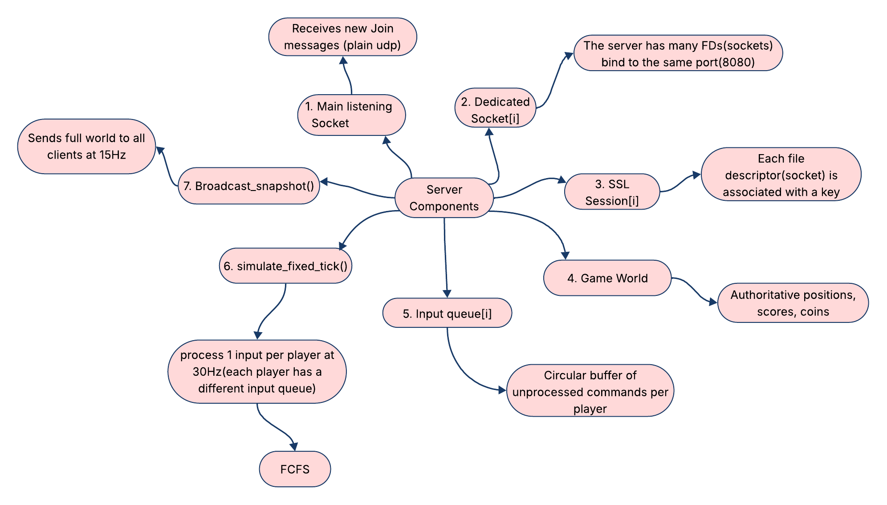

**What the server maintains:**
- **Main Socket** - Listens for new players (plain UDP)
- **Dedicated Sockets** - One per connected player (encrypted DTLS)
- **Each socket has an associated encryption key**

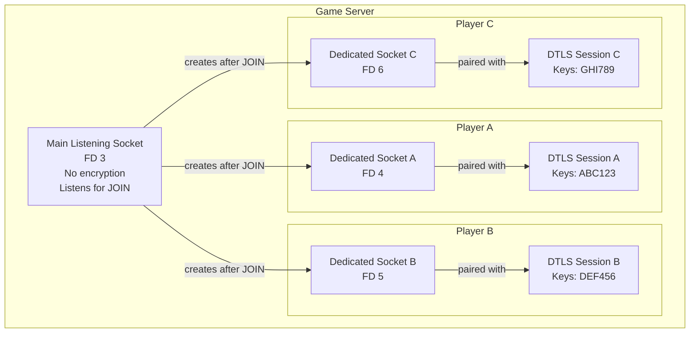

### ⭒ **Client Components**
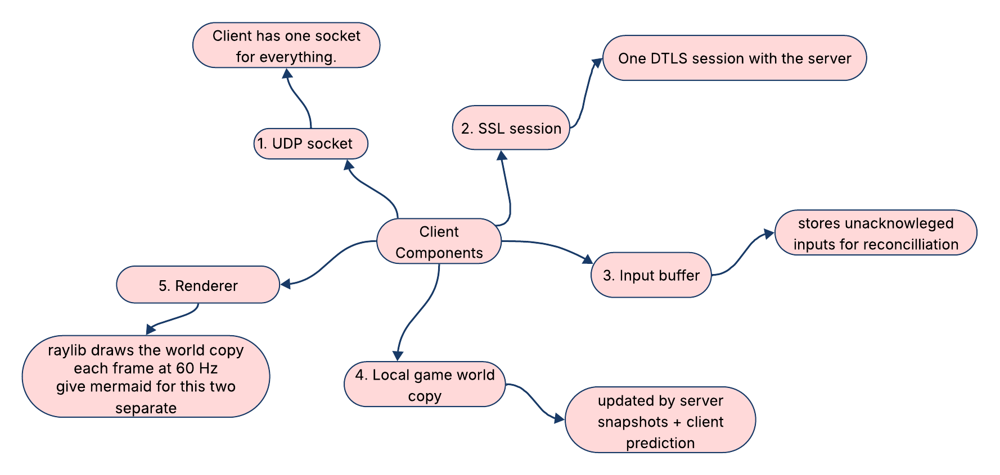

**What each client uses:**
- **Single UDP Socket** - Handles everything: joining, sending inputs, receiving game state

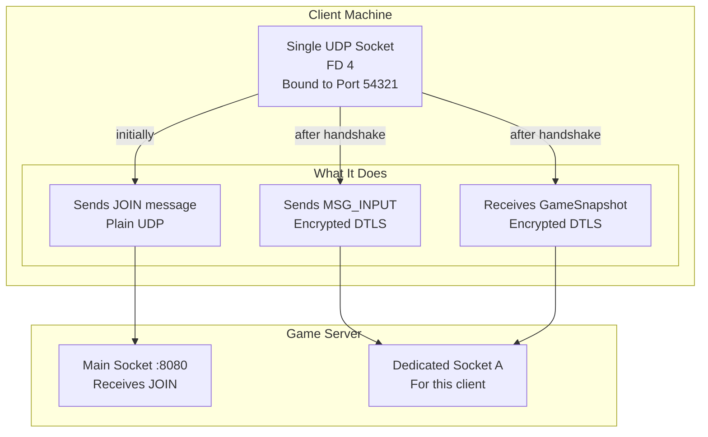

### ❊ **Three-Phase Communication Flow**

#### **Phase 1: Connection Establishment (Plain UDP - No Encryption)**

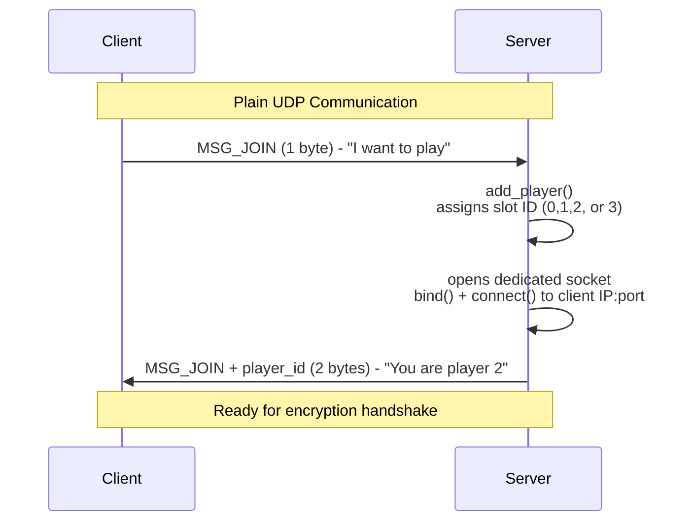

#### **Phase 2: DTLS Handshake (Establish Encryption)**

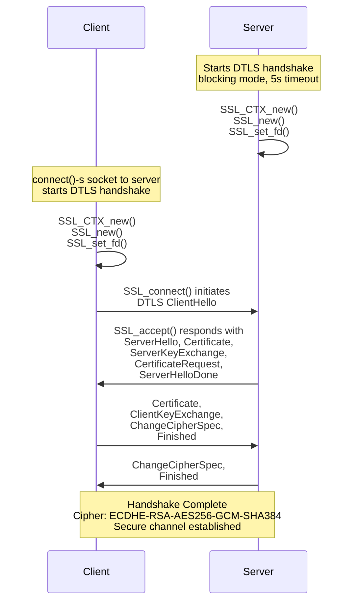

#### **Phase 3: Game Loop (All Traffic Encrypted)**

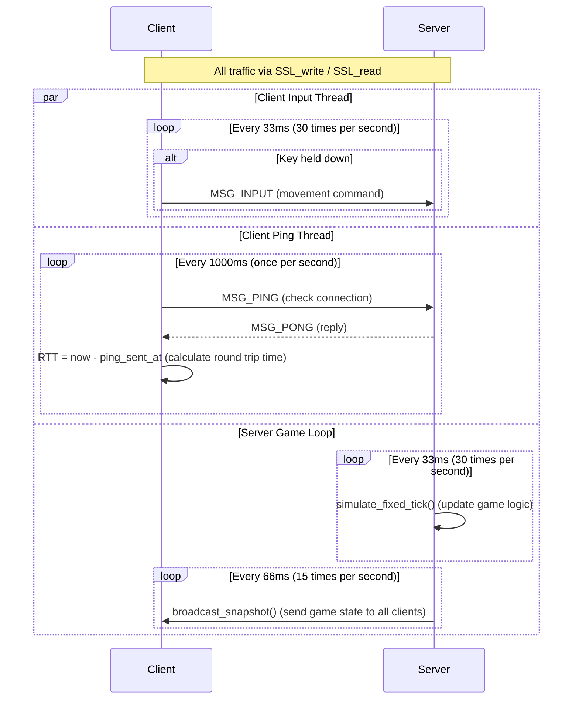

### ❊ Protocol Design(Wire format)
#### MSG_JOIN (Client → Server) - Plain UDP
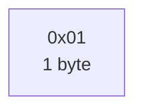
#### MSG_JOIN (Server → Client) - Plain UDP:
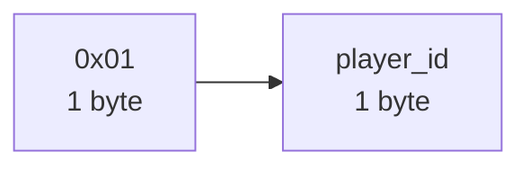
#### MSG_INPUT (Client → Server) - DTLS Encrypted
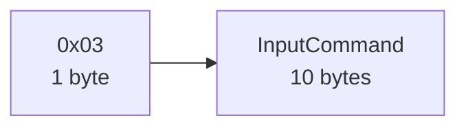


#### MSG_PING (Client → Server) - DTLS Encrypted
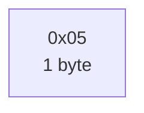

#### MSG_PONG (Server → Client) - DTLS Encrypted
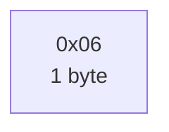

#### MSG_LEAVE (Client → Server) - DTLS Encrypted
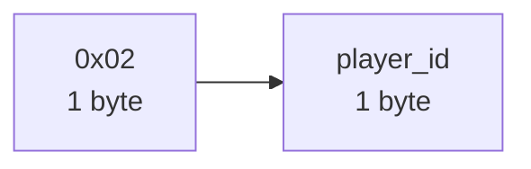

**InputCommand Structure (10 bytes total):**

| Field | Size | What it means |
|-------|------|----------------|
| **player_id** | 1 byte | Which player (0-3) is moving |
| **direction** | 1 byte | 0=up, 1=down, 2=left, 3=right, 4=none |
| **sequence** | 4 bytes | Counter that numbers each input (detects lost packets) |
| **timestamp_ms** | 4 bytes | When client sent this (measures latency) |

#### **Message Type 4: GameSnapshot (Server → Client) - DTLS Encrypted (~300 bytes)**

This is the complete game state sent 15 times per second:

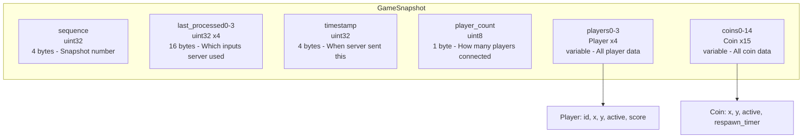

#### **Complete Protocol Summary:**

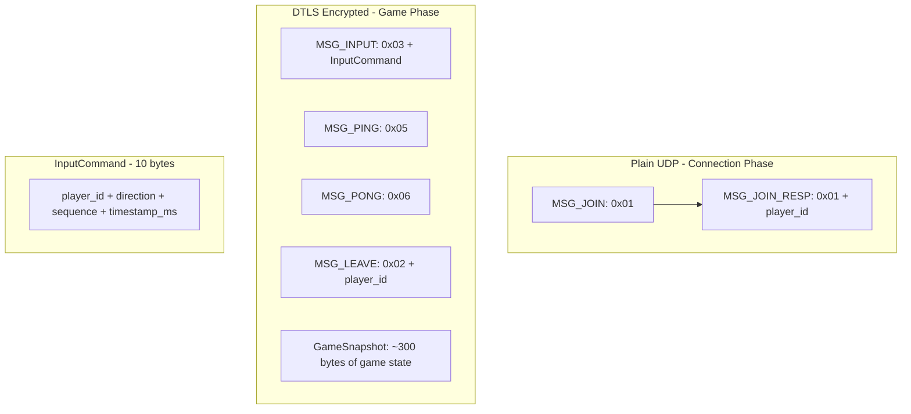

---

## **2. Socket Programming: Raw POSIX Implementation**

**Important:** Every socket operation uses raw POSIX calls. No networking framework is used.

### **Socket Creation**
```C
// network.c
// AF_INET = IPv4 address family, SOCK_DGRAM = UDP, 0 = default protocol
int sock = socket(AF_INET, SOCK_DGRAM, 0);
if (sock < 0) { perror("socket"); return -1; }
```

### **Binding the Server to a Port**
```C
// network.c : init_server_socket()
// SO_REUSEADDR lets us restart server immediately without waiting
int opt = 1;
setsockopt(sock, SOL_SOCKET, SO_REUSEADDR, &opt, sizeof(opt));

struct sockaddr_in addr = {0};
addr.sin_family      = AF_INET;        // IPv4
addr.sin_port        = htons(PORT);    // Convert to network byte order
addr.sin_addr.s_addr = INADDR_ANY;     // Accept connections on all network interfaces

bind(sock, (struct sockaddr *)&addr, sizeof(addr));
```

### **Non-blocking Mode - No Waiting**
```C
// network.c
// F_GETFL reads current flags, F_SETFL writes them back with O_NONBLOCK
// Result: recvfrom() returns immediately (-1) if no data waiting
int flags = fcntl(sock, F_GETFL, 0);
fcntl(sock, F_SETFL, flags | O_NONBLOCK);
```

### **Sending Data**
```C
// network.c — send_packet()
// sendto() used because server's listen socket isn't connected to anyone specific
// We specify destination address each time
sendto(sock, data, len, 0, (struct sockaddr *)addr, sizeof(*addr));
```

### **Receiving Data**
```C
// network.c — receive_packet()
// recvfrom() fills `from` with sender's IP and port
// Returns -1 immediately if nothing arrived (non-blocking mode)
socklen_t from_len = sizeof(*from);
recvfrom(sock, buffer, len, 0, (struct sockaddr *)from, &from_len);
```

### **Dedicated Per-Client Socket (Server Side)**
```C
// server_handlers.c - handle_new_join()
// Each connected player gets their own UDP socket on the server
int dsock = socket(AF_INET, SOCK_DGRAM, 0);
setsockopt(dsock, SOL_SOCKET, SO_REUSEADDR, &opt, sizeof(opt));
setsockopt(dsock, SOL_SOCKET, SO_REUSEPORT, &opt, sizeof(opt));
bind(dsock, (struct sockaddr *)&local, sizeof(local));
connect(dsock, (struct sockaddr *)peer, sizeof(*peer));
```

**Why connect() on UDP?** UDP is normally connectionless. connect() tells the kernel:
1. Only deliver packets from that specific IP:port to this socket
2. Allow send() instead of sendto() (destination is implied)
3. Required by OpenSSL's DTLS implementation
---

### **Socket Lifecycle Diagram:**

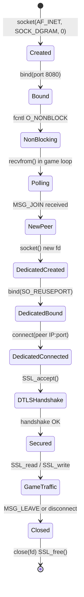

---

## **3. No Framework Abstraction - Raw System Calls Only**

**What we do NOT use:**
- No libevent, libuv, Boost.Asio (event libraries)
- No epoll, select, poll (multiplexing)
- No connection or session manager libraries
- Raylib is only for drawing - never touches sockets

**What we use directly (raw system calls):**
- `socket()` - Create file descriptors
- `bind()` - Claim a port
- `connect()` - Associate UDP socket with one peer
- `sendto()` - Send raw bytes to specific destination
- `recvfrom()` - Receive raw bytes and learn sender
- `fcntl()` - Set non-blocking mode
- `setsockopt()` - Set SO_REUSEADDR and SO_REUSEPORT
- `close()` - Release file descriptor
- `SSL_write()` - Encrypt and send (DTLS)
- `SSL_read()` - Receive and decrypt (DTLS)
---
### **The Manual Main Loop - No Event System**

```C
// server_main.c — game loop
while (running) {
    uint32_t now = get_time_ms();

    // MANUAL POLL #1: Check listen socket for new players
    // No select(), no epoll() - just try to receive
    while ((len = receive_packet(server_sock, buffer,
                                 sizeof(buffer), &client_addr)) > 0) {
        if ((uint8_t)buffer[0] == MSG_JOIN)
            handle_new_join(&client_addr);
    }

    // MANUAL POLL #2: Check each player's dedicated socket
    for (int i = 0; i < MAX_PLAYERS; i++) {
        if (world.players[i].active && client_ssl[i])
            recv_from_player(i);    // Calls SSL_read() directly
    }

    // MANUAL TIMING #1: Server simulation at 30 Hz
    if (now - last_tick_time >= (1000u / TICK_RATE)) {
        simulate_fixed_tick(&world);
        last_tick_time = now;
    }

    // MANUAL TIMING #2: Broadcast game state at 15 Hz
    if (now - last_broadcast >= (1000u / NETWORK_SEND_RATE)) {
        if (world.player_count > 0)
            broadcast_snapshot();
        last_broadcast = now;
    }

    usleep(1000);   // 1ms sleep prevents 100% CPU usage
}
```

---

## **4. Connection Handling**

### **New Player Joins - Step by Step**

```C
// server_handlers.c
void handle_new_join(struct sockaddr_in *peer) {

    // Step 1: Find empty player slot (0-3)
    int id = add_player(&world, peer);
    if (id < 0) { /* Server full - reject */ return; }

    // Step 2: Create dedicated UDP socket for this player
    int dsock = socket(AF_INET, SOCK_DGRAM, 0);
    // Bind and connect to peer's address...

    // Step 3: Tell client their player ID (plain UDP, not yet encrypted)
    uint8_t resp[2] = {MSG_JOIN, (uint8_t)id};
    sendto(server_sock, resp, 2, 0,
           (struct sockaddr *)peer, sizeof(*peer));

    // Step 4: Perform DTLS handshake (blocking, 5 second timeout)
    SSL *ssl = dtls_server_session(dtls_ctx, dsock, peer);
    if (!ssl) {
        // Handshake failed - clean up
        remove_player(&world, id);
        close(dsock);
        return;
    }

    // Step 5: Switch to non-blocking for game loop
    set_nonblocking(dsock);

    // Step 6: Store everything
    dedicated_sock[id] = dsock;
    client_ssl[id]     = ssl;
}
```

### **Player Disconnect - Graceful**
```C
// server_handlers.c — When MSG_LEAVE is received
remove_player(&world, id);              // Remove from game
dtls_session_free(client_ssl[id]);      // SSL_shutdown + SSL_free
client_ssl[id] = NULL;
close(dedicated_sock[id]);              // Close socket
dedicated_sock[id] = -1;
```
---
### **Sudden Disconnect - Network Failure**
```C
// server_handlers.c — recv_from_player()
// SSL_read returns <= 0 if client vanished
// Player slot stays allocated - allows reconnection from same IP:port
if (len <= 0) return;  // Just ignore, don't crash
```

### **Security Measures**

**Preventing Player ID Spoofing:**
```c
// server_handlers.c
// Client cannot move another player by faking player_id in packet
if (cmd->player_id != (uint8_t)id) break;  // Ignore spoofed packet
```

**Handling Duplicate Joins:**
```c
// server_main.c - Check if this IP:port is already connected
for (int i = 0; i < MAX_PLAYERS; i++) {
    if (world.players[i].active &&
        world.client_addrs[i].sin_addr.s_addr == client_addr.sin_addr.s_addr &&
        world.client_addrs[i].sin_port == client_addr.sin_port) {
        known = 1;  // Already connected - ignore duplicate JOIN
        break;
    }
}
```

---

## **5. Core Feature Implementation**

### **5.1 State Synchronization**

**How it works:** Server is the single source of truth. Every 66ms, server copies complete world state (4 players, 15 coins) into a GameSnapshot struct and sends it encrypted to every active client. Clients apply snapshot directly - server state overwrites client state.

```c
// server_handlers.c : broadcast_snapshot()
GameSnapshot snap;
snap.sequence     = global_sequence++;   // Increases by 1 each time
snap.timestamp    = get_time_ms();       // Server send time
snap.player_count = world.player_count;
memcpy(snap.players, world.players, sizeof(world.players));
memcpy(snap.coins,   world.coins,   sizeof(world.coins));

// Send to every connected client
for (int i = 0; i < MAX_PLAYERS; i++) {
    if (!world.players[i].active || !client_ssl[i]) continue;
    secure_send(client_ssl[i], &snap, sizeof(snap));
}
```
---
### **5.2 Client Prediction and Correction**

**How it works:** When player presses a key, client moves immediately without waiting for server (feels instant even at 100ms latency). Input stored in buffer and sent to server. When server snapshot arrives, client applies authoritative server position, then replays any inputs server hasn't acknowledged yet.

```c
// client_main.c — Input handling with prediction
if (dir > 0 && (now - last_input_time) >= INPUT_INTERVAL) {
    InputCommand cmd;
    cmd.player_id    = player_id;
    cmd.direction    = dir;
    cmd.sequence     = input_seq++;    // Each input gets unique number
    cmd.timestamp_ms = now;

    // 1. PREDICT: Move immediately (don't wait for server)
    update_player(&world, player_id, cmd.direction);

    // 2. STORE: Save for later reconciliation
    ibuf.inputs[ibuf.count++] = cmd;

    // 3. SEND: Encrypted to server
    uint8_t pkt[sizeof(cmd) + 1];
    pkt[0] = MSG_INPUT;
    memcpy(pkt + 1, &cmd, sizeof(cmd));
    secure_send(ssl, pkt, sizeof(pkt));
}

// client_main.c — Reconciliation when snapshot arrives
// Step 1: Apply authoritative server state
memcpy(world.players, snap->players, sizeof(world.players));

// Step 2: Discard inputs server already processed
uint32_t ack = snap->last_processed_input[player_id];
// Keep only inputs with sequence > ack (server hasn't seen these yet)

// Step 3: Replay remaining unacknowledged inputs
for (int i = 0; i < ibuf.count; i++) {
    update_player(&world, player_id, ibuf.inputs[i].direction);
}
```
---
### **5.3 Packet Loss Tolerance**

**How it works:** UDP delivers no guarantees. 20% packet loss simulated deliberately. System tolerates loss two ways:
1. Reconciliation replays inputs from lost snapshots when next snapshot arrives
2. Sequence numbers detect gaps and count lost packets for diagnostics

```c
// client_main.c — Detect packet loss via sequence number gaps
if (expected_seq > 0 && snap->sequence > expected_seq)
    pkts_lost += snap->sequence - expected_seq;   // Gap = lost packets
expected_seq = snap->sequence + 1;
pkts_received++;

// Calculate loss percentage
if (total > 0)
    stats.packet_loss_rate = (float)pkts_lost / (float)total * 100.0f;

// network.c — Simulated 20% packet loss on plain UDP channel
if (rand() % 100 < 20) return;   // Drop 20% of packets silently
sendto(sock, data, len, 0, (struct sockaddr *)addr, sizeof(*addr));
```
---
### **5.4 Update Rate Optimization**

**How it works:** Three separate rates used deliberately:
- **Simulation: 30 Hz** - Server processes one input per player per tick
- **Network: 15 Hz** - Server broadcasts snapshots (half the sim rate)
- **Render: 60 Hz** - Client draws frames between snapshots using prediction

Sim > Net ensures game logic stays consistent even if broadcasts are missed. Net < Render means client renders smooth frames between snapshots.

```c
// common.h
#define TICK_RATE         30    // Server simulation frequency
#define NETWORK_SEND_RATE 15    // Snapshot broadcast frequency

// server_main.c
if (now - last_tick_time >= (1000u / TICK_RATE)) {      // Every 33ms
    simulate_fixed_tick(&world);   // Update game logic
    last_tick_time = now;
}
if (now - last_broadcast >= (1000u / NETWORK_SEND_RATE)) { // Every 66ms
    broadcast_snapshot();           // Send game state to clients
    last_broadcast = now;
}

// game.c — One input per tick maximum
void simulate_fixed_tick(GameWorld *world) {
    for (int i = 0; i < MAX_PLAYERS; i++) {
        if (!world->players[i].active) continue;
        InputCommand cmd;
        if (pop_input(&world->input_queues[i], &cmd))   // ONE input only
            update_player(world, i, cmd.direction);
    }
}
```
---
### **5.5 Latency and Jitter Analysis**

**How it works:** Five metrics tracked independently and displayed live:

| Metric | How it's measured |
|--------|-------------------|
| **Latency** | Server puts timestamp in snapshot; client subtracts from receive time |
| **Jitter** | Variation between consecutive latency samples |
| **RTT** | Client sends ping; server echoes; client measures round trip |
| **Loss** | Sequence number gaps = lost packets |
| **Bandwidth** | Count bytes received per second window |

```c
// client_main.c — Latency calculation
uint32_t recv_now = get_time_ms();
float latency = (float)(recv_now - snap->timestamp);

// EWMA smoothing (α=0.1) - reduces noise
stats.avg_latency_ms = stats.avg_latency_ms * 0.9f + latency * 0.1f;

// Jitter = variation in latency
float diff = latency - last_latency;
if (diff < 0.0f) diff = -diff;
stats.jitter_ms = stats.jitter_ms * 0.9f + diff * 0.1f;

// RTT via explicit ping/pong
if (now - last_ping >= 1000u) {  // Once per second
    secure_send(ssl, &ping, 1);
    ping_sent_at = now;
}
// On receiving MSG_PONG:
uint32_t rtt = get_time_ms() - ping_sent_at;
stats.rtt_ms = stats.rtt_ms * 0.875f + rtt * 0.125f;  // EWMA

// Bandwidth - 1-second sliding window
bw_bytes += len;   // Accumulate in receive loop
if (bw_elapsed >= 1000u) {
    stats.bandwidth_kbps = (float)bw_bytes / (float)bw_elapsed;
    bw_bytes = 0;
}
```

**Metrics Flow Diagram:**

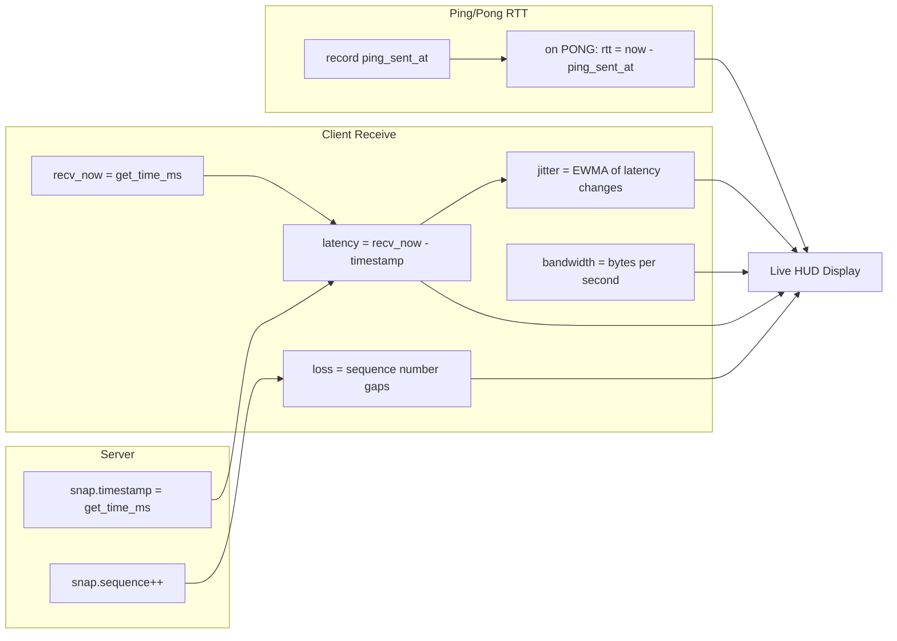
