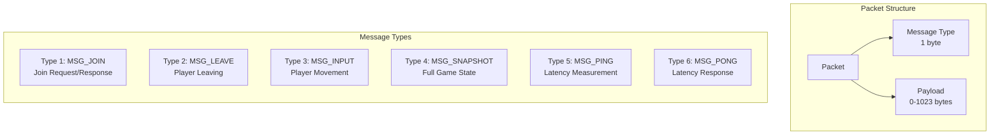
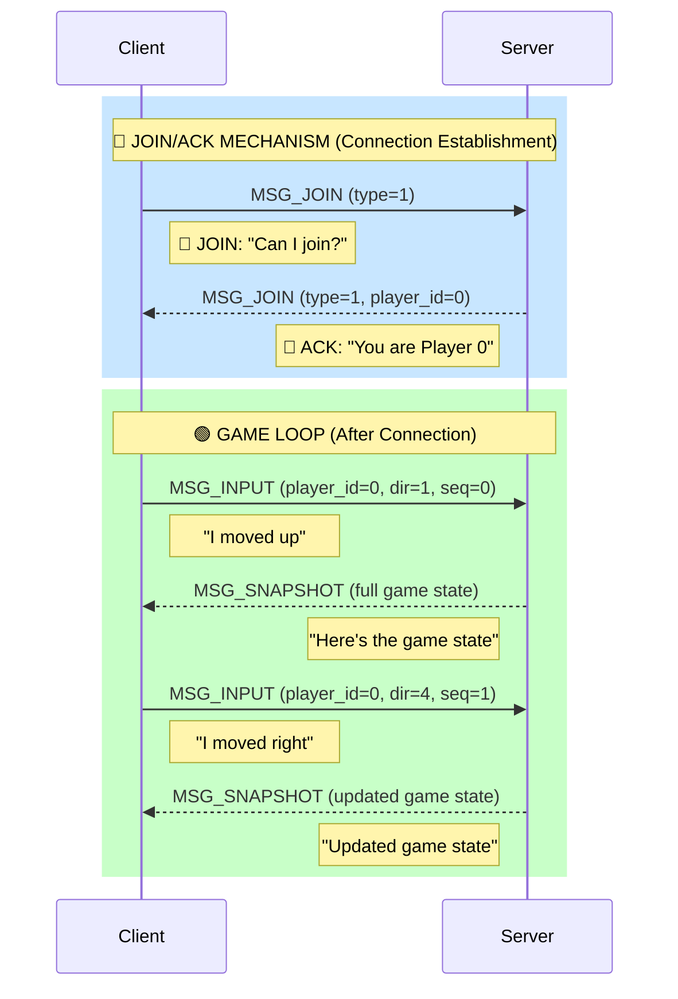
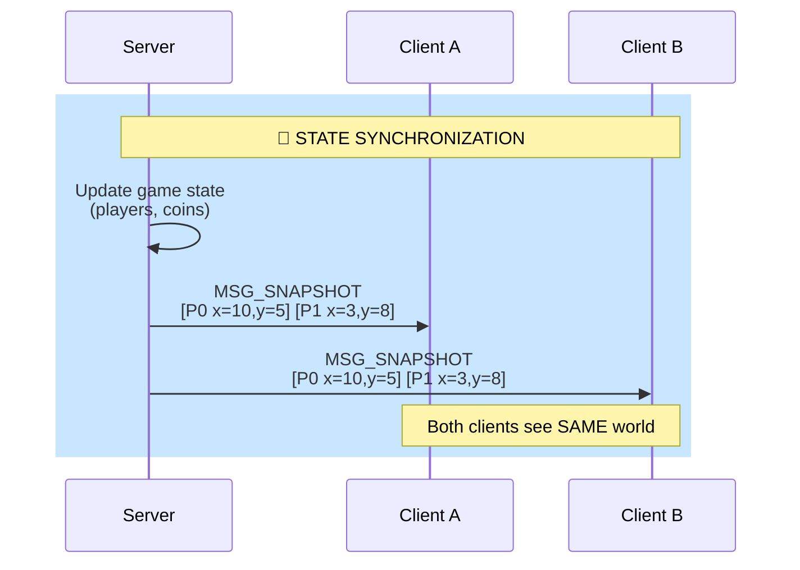
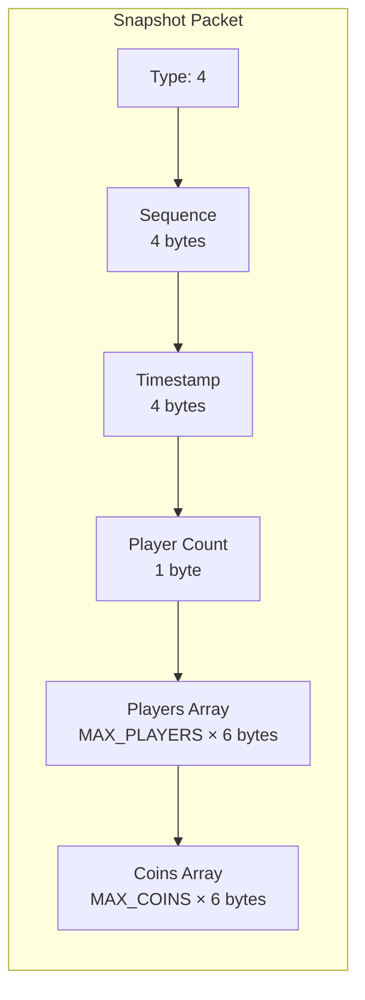
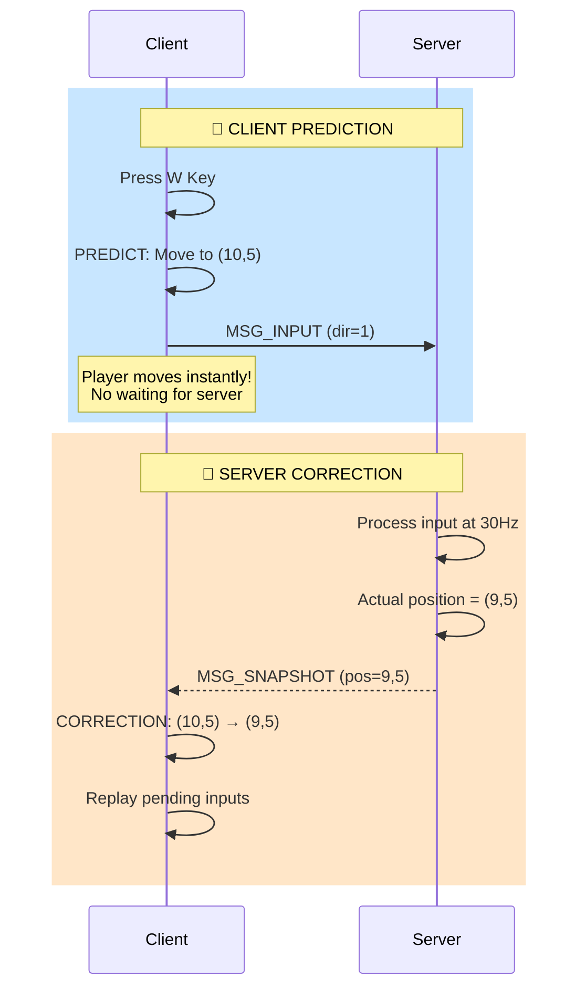
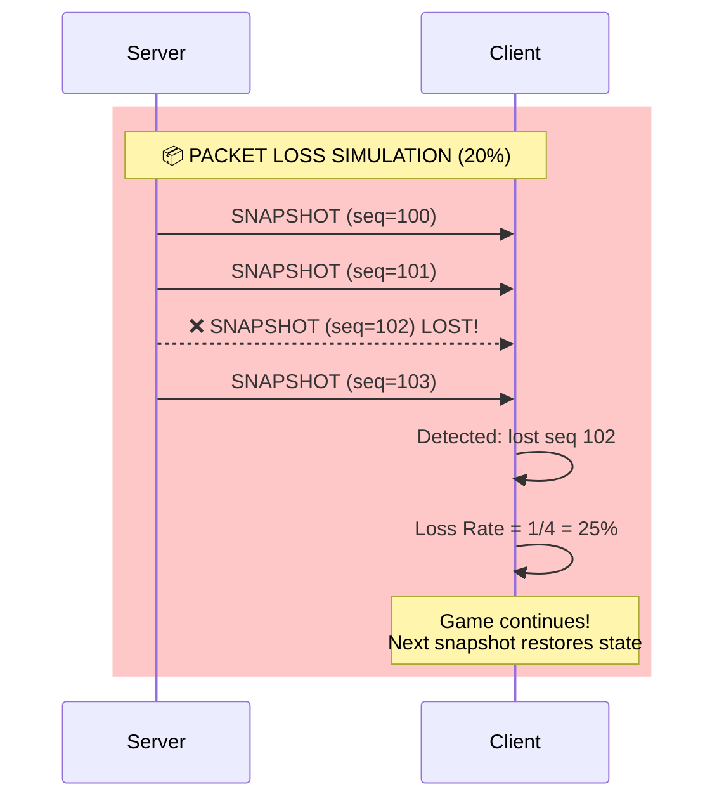
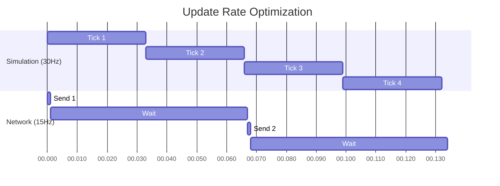
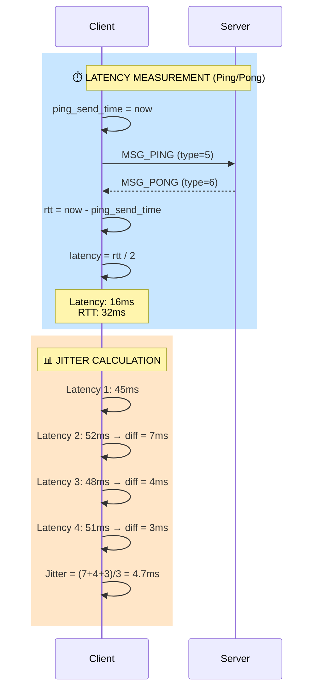

# Real-time Multiplayer Game Networking Engine
## UDP based networking engine for a real-time multiplayer game where low latency is critical.
## **Name: Dharani S**
## **srn: PES2UG24CS157**
## **sECTION: c**
## eXPECTATIONS:
### State synchronization among clients
### Client prediction and correction
### Packet loss tolerance
### Update rate optimization
### Latency and jitter analysis
---

## 1. Connetion establishment and socket creation:

### Application layer protocol -> custom udp based protocol
### packet structure:

### Join - Ack mechanism: 



## **All Message Types and Their Payloads**

| Message | Direction | Message Type | Payload |
|---------|-----------|--------------|---------|
| **JOIN Request** | Client → Server | 1 | None (0 bytes) |
| **JOIN Response** | Server → Client | 1 | player_id (1 byte) |
| **LEAVE** | Client → Server | 2 | player_id (1 byte) |
| **INPUT** | Client → Server | 3 | player_id, direction, sequence, timestamp (10 bytes) |
| **SNAPSHOT** | Server → Client | 4 | sequence, timestamp, player_count, players[], coins[] (~500 bytes) |
| **PING** | Client → Server | 5 | None or sequence (0-4 bytes) |
| **PONG** | Server → Client | 6 | None or sequence (0-4 bytes) |
---
### Code that implements join Ack:

### Client side (join):
```C
// Send JOIN request
uint8_t join_msg = MSG_JOIN;  // [1]
send_packet(client_sock, &server_addr, &join_msg, 1);
printf("JOIN sent\n");

// Wait for ACK
while (player_id == -1 && !timeout) {
    int len = receive_packet(client_sock, buffer, ...);
    if (buffer[0] == MSG_JOIN && len >= 2) {
        player_id = buffer[1];  // Extract player_id from ACK
        printf("ACK received! I am Player %d\n", player_id);
    }
}
```
### Server- Side (ACK):
```C
// Receive JOIN
if (buffer[0] == MSG_JOIN) {
    int id = add_player(&world, &client_addr);
    
    // Send ACK with player_id
    uint8_t ack[2] = {MSG_JOIN, (uint8_t)id};  // [1, id]
    send_packet(server_sock, &client_addr, ack, 2);
    printf("ACK sent: You are Player %d\n", id);
}
```
## **2. State Synchronization Among Clients**

### **How it Works:**
Server broadcasts full game state to all clients at 15Hz. Each client receives and renders the same world.



### **Packet Structure: MSG_SNAPSHOT (Type 4)**



### **Server Code (Broadcast):**
```c
void broadcast_snapshot() {
    GameSnapshot snapshot;
    snapshot.sequence = snapshot_sequence++;
    snapshot.timestamp = get_time_ms();
    snapshot.player_count = world.player_count;
    
    // Copy all players and coins
    memcpy(snapshot.players, world.players, sizeof(world.players));
    memcpy(snapshot.coins, world.coins, sizeof(world.coins));
    
    // Send to every active player
    for (int i = 0; i < MAX_PLAYERS; i++) {
        if (world.players[i].active) {
            send_packet(server_sock, &world.client_addrs[i], 
                       &snapshot, sizeof(snapshot));
        }
    }
}
```

### **Client Code (Receive):**
```c
if ((size_t)len >= sizeof(GameSnapshot)) {
    GameSnapshot *snap = (GameSnapshot*)buffer;
    
    // Update local world with server's authoritative state
    memcpy(world.players, snap->players, sizeof(world.players));
    memcpy(world.coins, snap->coins, sizeof(world.coins));
    world.player_count = snap->player_count;
    
    // Now all clients have same world state
}
```

---

## **3. Client Prediction and Correction**

### **How it Works:**
Client moves instantly on key press (prediction). Server later corrects if position was wrong (reconciliation).



### **Client Code (Prediction):**
```c
if (dir > 0) {
    InputCommand cmd;
    cmd.player_id = player_id;
    cmd.direction = dir;
    cmd.sequence = input_sequence++;
    
    // Store for later reconciliation
    input_buffer.inputs[input_buffer.count++] = cmd;
    
    // PREDICTION: Move instantly!
    update_player(&world, player_id, dir);
    
    // Send to server
    send_packet_with_stats(out, sizeof(out));
}
```

### **Client Code (Correction):**
```c
// When snapshot arrives
if (world.players[player_id].x != snap->players[player_id].x ||
    world.players[player_id].y != snap->players[player_id].y) {
    
    printf("CORRECTION: (%d,%d) -> (%d,%d)\n",
           world.players[player_id].x, world.players[player_id].y,
           snap->players[player_id].x, snap->players[player_id].y);
}

// Server is authority - apply correction
world.players[player_id] = snap->players[player_id];

// Replay pending inputs that server hasn't processed yet
for (int i = 0; i < input_buffer.count; i++) {
    update_player(&world, player_id, input_buffer.inputs[i].direction);
}
```

---

## **4. Packet Loss Tolerance**

### **How it Works:**
Sequence numbers detect lost packets. No retransmission - next snapshot contains full state.



### **Packet Loss Detection:**
```c
// Track last received sequence
static uint32_t last_sequence = 0;

if (snap->sequence > last_sequence + 1) {
    // Lost packets detected!
    int lost = snap->sequence - last_sequence - 1;
    stats.packets_lost += lost;
    
    printf("PACKET LOSS: lost %d packets (seq %u -> %u)\n", 
           lost, last_sequence, snap->sequence);
}
last_sequence = snap->sequence;
```

### **Simulated Packet Loss (Testing):**
```c
void send_packet(int sock, struct sockaddr_in *addr, void *data, size_t len) {
    if (!addr) return;
    
    // Simulate 20% packet loss for testing
    if (rand() % 100 < 20) {
        return;  // Drop packet
    }
    
    sendto(sock, data, len, 0, (struct sockaddr *)addr, sizeof(*addr));
}
```

---

## **5. Update Rate Optimization**

### **How it Works:**
Simulation runs at 30Hz (accurate physics). Network sends at 15Hz (saves 50% bandwidth).



### **Code Implementation:**
```c
#define TICK_RATE 30        // Simulation: 30 times/second
#define NETWORK_SEND_RATE 15 // Network: 15 times/second

while (running) {
    uint32_t now = get_time_ms();
    
    // Fixed timestep simulation (30Hz)
    if (now - last_tick_time >= (1000 / TICK_RATE)) {
        simulate_fixed_tick(&world);  // Update game logic
        last_tick_time = now;
    }
    
    // Network broadcast (15Hz) - half the simulation rate
    if (now - last_broadcast >= (1000 / NETWORK_SEND_RATE)) {
        broadcast_snapshot();  // Send state to clients
        last_broadcast = now;
    }
}
```

---

## **6. Latency and Jitter Analysis**

### **How it Works:**
Ping/Pong messages measure RTT. Sequence tracking detects packet loss. Exponential moving average smooths measurements.



### **Latency Measurement (Ping/Pong):**
```c
// Client sends ping
if (now - last_ping >= 1000) {
    uint8_t ping = MSG_PING;
    ping_send_time = now;
    send_packet_with_stats(&ping, 1);
    last_ping = now;
}

// Server responds immediately
case MSG_PING:
    uint8_t pong = MSG_PONG;
    send_packet(server_sock, &client_addr, &pong, 1);
    break;

// Client receives pong
case MSG_PONG:
    uint32_t rtt = get_time_ms() - ping_send_time;
    uint32_t latency = rtt / 2;  // One-way latency
    break;
```

### **Jitter Calculation:**
```c
static uint32_t prev_latency = 0;
float jitter = 0;

// Calculate jitter as latency variation
float diff = abs((int)latency - (int)prev_latency);
jitter = jitter * 0.9 + diff * 0.1;  // Exponential moving average
prev_latency = latency;
```

### **Packet Loss Rate:**
```c
// Detect lost packets via sequence gaps
if (snap->sequence > last_sequence + 1) {
    int lost = snap->sequence - last_sequence - 1;
    stats.packets_lost += lost;
}

// Calculate loss percentage
stats.packet_loss_rate = (float)stats.packets_lost / 
                         (stats.packets_lost + stats.packets_received) * 100;
```

### **Displayed Network Stats:**
```
Latency: 5 ms | Jitter: 2 ms | Loss: 18% | RTT: 16 ms
```

---

## **Summary Table**

| Feature | Implementation | Key Code |
|---------|----------------|----------|
| **State Sync** | Full snapshots at 15Hz | `broadcast_snapshot()` |
| **Prediction** | Move instantly on input | `update_player()` before server |
| **Correction** | Server state overwrites | `world.players[id] = snap->players[id]` |
| **Loss Tolerance** | Sequence numbers, no retransmit | `if (seq > last_seq+1) lost++` |
| **Rate Optimization** | Simulate 30Hz, send 15Hz | `TICK_RATE=30, NETWORK_SEND_RATE=15` |
| **Latency** | Ping/Pong RTT measurement | `rtt = now - ping_send_time` |
| **Jitter** | Latency variance | `jitter = (curr - prev)` |
## **Complete Bandwidth Tracking Table**

| Time (ms) | Action | bytes_sent | last_bytes_sent | bytes_diff | Bandwidth (KB/s) |
|-----------|--------|------------|-----------------|------------|------------------|
| **0** | Start | 0 | 0 | 0 | - |
| **100** | Send 150 bytes | 150 | 0 | - | - |
| **200** | Send 150 bytes | 300 | 0 | - | - |
| **300** | Send 150 bytes | 450 | 0 | - | - |
| **400** | Send 150 bytes | 600 | 0 | - | - |
| **500** | Send 150 bytes | 750 | 0 | - | - |
| **600** | Send 150 bytes | 900 | 0 | - | - |
| **700** | Send 150 bytes | 1050 | 0 | - | - |
| **800** | Send 150 bytes | 1200 | 0 | - | - |
| **900** | Send 150 bytes | 1350 | 0 | - | - |
| **1000** | **CALCULATE** | 1500 | 0 | 1500 - 0 = 1500 | 1500 × 8 / 1024 = **11.7 KB/s** |
| **1000** | **UPDATE** | 1500 | 1500 | - | - |
| **1100** | Send 100 bytes | 1600 | 1500 | - | - |
| **1200** | Send 100 bytes | 1700 | 1500 | - | - |
| **1300** | Send 100 bytes | 1800 | 1500 | - | - |
| **1400** | Send 100 bytes | 1900 | 1500 | - | - |
| **1500** | Send 100 bytes | 2000 | 1500 | - | - |
| **1600** | Send 100 bytes | 2100 | 1500 | - | - |
| **1700** | Send 100 bytes | 2200 | 1500 | - | - |
| **1800** | Send 100 bytes | 2300 | 1500 | - | - |
| **1900** | Send 100 bytes | 2400 | 1500 | - | - |
| **2000** | **CALCULATE** | 2500 | 1500 | 2500 - 1500 = 1000 | 1000 × 8 / 1024 = **7.8 KB/s** |
| **2000** | **UPDATE** | 2500 | 2500 | - | - |
| **3000** | **CALCULATE** | 3000 | 2500 | 3000 - 2500 = 500 | 500 × 8 / 1024 = **3.9 KB/s** |
| **3000** | **UPDATE** | 3000 | 3000 | - | - |

---

## **Formula Used**

```
bytes_diff = bytes_sent - last_bytes_sent
Bandwidth (KB/s) = (bytes_diff × 8) / 1024
last_bytes_sent = bytes_sent (after calculation)
```

---

## **Simple Pattern**

| Every Second | We Do |
|--------------|-------|
| **1.** | Look at current `bytes_sent` |
| **2.** | Subtract `last_bytes_sent` |
| **3.** | That's how many bytes sent in last second |
| **4.** | Update `last_bytes_sent` to current value |

Step 1: bytes_diff × 8 = bits sent
Step 2: bits ÷ 1024 = kilobits
Result: kilobits per second (kbps)
struct sockaddr_in
┌─────────────────────────────────────────────┐
│ sin_family  = AF_INET     (2 bytes)        │
│ sin_port    = 8080        (2 bytes)        │
│ sin_addr    = 127.0.0.1   (4 bytes)        │
│ sin_zero    = {0,0,0,0,0,0,0,0} (8 bytes) │
└─────────────────────────────────────────────┘
Total: 16 bytes
